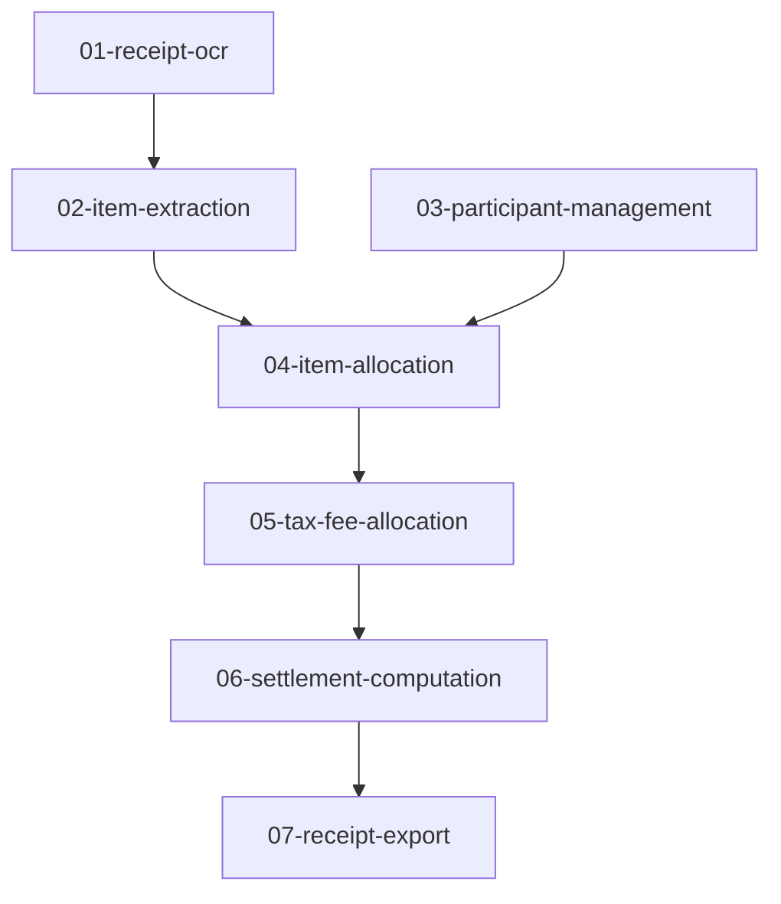

# Sprint 03: Receipt Splitting

## Overview

This sprint implements the receipt splitting feature for shared expenses. This includes OCR-based receipt parsing, item extraction, participant management, flexible allocation strategies, and settlement computation.

---

## Sprint Goals

1. **Receipt OCR** - Capture and extract text from receipt images
2. **Item Extraction** - Parse line items with prices from OCR output
3. **Participant Management** - Manage people involved in splits
4. **Item Allocation** - Assign items to participants (equal, custom, percentage)
5. **Tax/Fee Allocation** - Distribute taxes, tips, and fees
6. **Settlement Computation** - Calculate who owes what
7. **Receipt Export** - Share splits via image/PDF/text

---

## Dependencies



### External Dependencies
- Sprint 01: Database Schema (ReceiptSplit, ReceiptItem, Participant tables)
- Sprint 01: Money type for precise calculations
- ML Kit (Android) / Tesseract (Desktop) for OCR - ADR-002

---

## Implementation Plans

| # | File | Description | Complexity |
|---|------|-------------|------------|
| 01 | [01-receipt-ocr.md](./01-receipt-ocr.md) | Camera capture and OCR extraction | High |
| 02 | [02-item-extraction.md](./02-item-extraction.md) | Parse line items from OCR text | High |
| 03 | [03-participant-management.md](./03-participant-management.md) | Create and manage split participants | Low |
| 04 | [04-item-allocation.md](./04-item-allocation.md) | Assign items to participants | Medium |
| 05 | [05-tax-fee-allocation.md](./05-tax-fee-allocation.md) | Distribute taxes, tips, fees | Medium |
| 06 | [06-settlement-computation.md](./06-settlement-computation.md) | Calculate balances and settlements | Medium |
| 07 | [07-receipt-export.md](./07-receipt-export.md) | Export and share split results | Low |

---

## Architecture Reference

Per [10-receipt-splitting.md](../../PRDs/10-receipt-splitting.md):

### Key Design Decisions
- **Local-First**: All processing happens on-device
- **Platform OCR**: ML Kit on Android, Tesseract on Desktop (ADR-002)
- **Precise Math**: Integer-based Money type for all calculations
- **Fair Allocation**: Largest-remainder method for rounding

### Data Model
```
ReceiptSplit (1) ─┬── ReceiptItem (*)
                  └── Participant (*)

ReceiptItem (*) ─── ItemAllocation (*) ─── Participant (*)
```

---

## Acceptance Criteria

### MVP (Release 1.0)
- [ ] Capture receipt image from camera/gallery
- [ ] Extract text via platform OCR
- [ ] Parse line items with prices
- [ ] Add/remove participants
- [ ] Assign items to participants (equal split, custom)
- [ ] Handle tax and tip allocation
- [ ] Calculate who owes what
- [ ] Share split summary

### Enhanced (Release 1.1+)
- [ ] Multi-receipt support
- [ ] Recurring participants (contacts)
- [ ] Venmo/PayPal deep links
- [ ] Receipt history and templates

---

## Testing Strategy

### Unit Tests
- Item extraction regex patterns
- Money allocation calculations
- Settlement computation
- Tax distribution algorithms

### Integration Tests
- OCR → Item extraction pipeline
- Full split workflow end-to-end
- Export generation

### Manual Testing
- Various receipt formats (grocery, restaurant, retail)
- Different languages/currencies
- Edge cases (blurry images, handwritten)

---

## Q/A Guidelines

### Common Issues
1. **OCR accuracy low**: Check image resolution, lighting, focus
2. **Items not parsed**: Verify regex patterns match receipt format
3. **Rounding errors**: Ensure largest-remainder method used
4. **Settlement incorrect**: Verify all allocations sum to item total

### Review Checklist
- [ ] Money calculations use integer minor units
- [ ] No floating-point math for currency
- [ ] Allocations always sum exactly to totals
- [ ] Platform-specific code properly abstracted

---

## Code Implementation Cycle

For each implementation plan:

1. **Read** the full implementation plan
2. **Implement** step by step, following code examples
3. **Test** each component before moving to next
4. **Verify** acceptance criteria pass
5. **Document** any deviations from plan

---

## Sprint Deliverables

```
shared/src/commonMain/kotlin/com/ledgerlens/
├── receipt/
│   ├── ReceiptCaptureService.kt
│   ├── OcrService.kt (expect/actual)
│   ├── ItemExtractor.kt
│   ├── ReceiptParser.kt
│   └── ReceiptSplitService.kt
├── splitting/
│   ├── ParticipantService.kt
│   ├── ItemAllocator.kt
│   ├── TaxAllocator.kt
│   └── SettlementCalculator.kt
└── export/
    └── SplitExporter.kt
```

