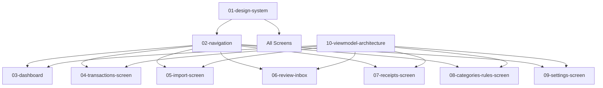

# Sprint 04: UI Implementation

## Overview

This sprint implements the user interface using Compose Multiplatform, covering all main screens, navigation, and the shared ViewModel architecture.

---

## Sprint Goals

1. **Design System** - Colors, typography, spacing, reusable components
2. **Navigation** - Tab-based navigation with deep linking
3. **Dashboard** - Overview with spending summaries and charts
4. **Transactions Screen** - List, search, filter, and edit transactions
5. **Import Screen** - File picker, import progress, review flow
6. **Review Inbox** - Categorization review with bulk actions
7. **Receipts Screen** - Split management and settlement tracking
8. **Categories/Rules Screen** - Manage categories and categorization rules
9. **Settings Screen** - Preferences, data management, about
10. **ViewModel Architecture** - Shared state management pattern

---

## Dependencies



### External Dependencies
- Sprint 01: All data layer repositories
- Sprint 02: Categorization services
- Sprint 03: Receipt splitting services
- Compose Multiplatform runtime

---

## Implementation Plans

| # | File | Description | Complexity |
|---|------|-------------|------------|
| 01 | [01-design-system.md](./01-design-system.md) | Theme, colors, typography, base components | Medium |
| 02 | [02-navigation.md](./02-navigation.md) | Navigation graph and tab structure | Medium |
| 03 | [03-dashboard.md](./03-dashboard.md) | Home screen with summaries and charts | High |
| 04 | [04-transactions-screen.md](./04-transactions-screen.md) | Transaction list and detail views | High |
| 05 | [05-import-screen.md](./05-import-screen.md) | Import wizard and progress | Medium |
| 06 | [06-review-inbox.md](./06-review-inbox.md) | Categorization review interface | Medium |
| 07 | [07-receipts-screen.md](./07-receipts-screen.md) | Receipt splitting UI | High |
| 08 | [08-categories-rules-screen.md](./08-categories-rules-screen.md) | Category and rule management | Medium |
| 09 | [09-settings-screen.md](./09-settings-screen.md) | App settings and preferences | Low |
| 10 | [10-viewmodel-architecture.md](./10-viewmodel-architecture.md) | Shared ViewModel pattern | Medium |

---

## Architecture Reference

Per [11-ui-and-navigation.md](../../PRDs/11-ui-and-navigation.md):

### Key Design Decisions
- **Compose Multiplatform**: Single UI codebase for Android and Desktop
- **Material 3**: Modern design language with dynamic theming
- **Unidirectional Data Flow**: ViewModel → State → UI → Events
- **Navigation Component**: Type-safe navigation with deep links

### Screen Hierarchy
```
App
├── BottomNavigation
│   ├── Dashboard (Home)
│   ├── Transactions
│   ├── Import
│   └── Settings
├── Full-screen flows
│   ├── Review Inbox
│   ├── Receipt Split
│   └── Category Editor
└── Dialogs/Sheets
    ├── Transaction Detail
    ├── Filter Sheet
    └── Quick Actions
```

---

## Acceptance Criteria

### MVP (Release 1.0)
- [ ] All screens navigable and functional
- [ ] Dark/light theme support
- [ ] Responsive layouts (phone, tablet, desktop)
- [ ] Keyboard navigation (desktop)
- [ ] Loading and error states
- [ ] Empty states with guidance

### Enhanced (Release 1.1+)
- [ ] Animations and transitions
- [ ] Gesture support (swipe actions)
- [ ] Accessibility compliance
- [ ] Localization support

---

## Testing Strategy

### Unit Tests
- ViewModel state transformations
- Navigation route parsing
- Format utilities (dates, currency)

### UI Tests
- Screen rendering with test data
- Navigation flows
- User interactions

### Manual Testing
- Different screen sizes
- Light/dark modes
- Accessibility scanner

---

## Q/A Guidelines

### Common Issues
1. **Recomposition issues**: Check for unstable parameters in composables
2. **Navigation crashes**: Verify route parameters match expected types
3. **State not updating**: Ensure StateFlow collection in composables
4. **Memory leaks**: Verify ViewModel scoping

### Review Checklist
- [ ] Composables are stateless where possible
- [ ] ViewModels use StateFlow for state
- [ ] Navigation uses type-safe routes
- [ ] Error states handled gracefully
- [ ] Loading indicators shown appropriately

---

## Code Implementation Cycle

For each implementation plan:

1. **Read** the full implementation plan
2. **Implement** design system components first
3. **Build** screens following the dependency order
4. **Test** each screen with mock data
5. **Integrate** with real services
6. **Polish** animations and edge cases

---

## Sprint Deliverables

```
shared/src/commonMain/kotlin/com/ledgerlens/
├── ui/
│   ├── theme/
│   │   ├── Color.kt
│   │   ├── Type.kt
│   │   ├── Theme.kt
│   │   └── Spacing.kt
│   ├── components/
│   │   ├── LedgerButton.kt
│   │   ├── LedgerCard.kt
│   │   ├── MoneyText.kt
│   │   ├── CategoryChip.kt
│   │   └── ...
│   ├── navigation/
│   │   ├── NavGraph.kt
│   │   ├── Routes.kt
│   │   └── BottomNavBar.kt
│   └── screens/
│       ├── dashboard/
│       ├── transactions/
│       ├── import/
│       ├── review/
│       ├── receipts/
│       ├── categories/
│       └── settings/
└── viewmodel/
    ├── BaseViewModel.kt
    ├── DashboardViewModel.kt
    ├── TransactionsViewModel.kt
    └── ...
```

