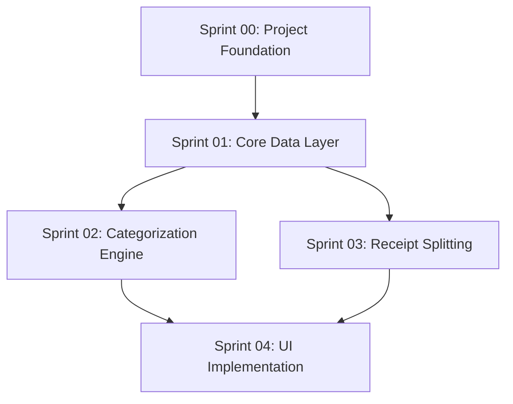

# LedgerLens Implementation Plan

> **Local-first personal finance app** that parses bank statements and receipts, auto-categorizes transactions, and supports item-level bill splitting.

---

## Overview

This directory contains the sprint-based implementation plans for LedgerLens. Each sprint folder includes detailed task breakdowns, acceptance criteria, and technical specifications.

**Related Documentation:**
- [PRD Documentation](../PRDs/README.md) - Product requirements and specifications
- [Architecture Audit Report](../ARCHITECTURE_AUDIT_REPORT.md) - Implementation guardrails and constraints
- [Architecture Decision Records](../PRDs/13-architecture-decision-records.md) - Key technical decisions

**Implementation Status:**
<!-- Status badges - update as sprints progress -->


---

## Sprint Overview

| Sprint | Name | Focus Area | Status |
|--------|------|------------|--------|
| [00](./00-project-foundation/) | Project Foundation | KMP setup, build system, CI/CD | ✅ Complete |
| [01](./01-core-data-layer/) | Core Data Layer | Database, encryption, import pipeline | ✅ Complete |
| [02](./02-categorization-engine/) | Categorization Engine | ML inference, rules, learning loop | ✅ Complete |
| [03](./03-receipt-splitting/) | Receipt Splitting | OCR, item extraction, settlements | ✅ Complete |
| [04](./04-ui-implementation/) | UI Implementation | All screens with Compose Multiplatform | Not Started |

---

## Sprint Dependencies

The following diagram shows the dependencies between sprints:

```
Sprint Dependencies Diagram
============================

                    ┌─────────────────┐
                    │   Sprint 00     │
                    │   Project       │
                    │   Foundation    │
                    └────────┬────────┘
                             │
                             ▼
                    ┌─────────────────┐
                    │   Sprint 01     │
                    │   Core Data     │
                    │   Layer         │
                    └────────┬────────┘
                             │
               ┌─────────────┴─────────────┐
               │                           │
               ▼                           ▼
      ┌─────────────────┐         ┌─────────────────┐
      │   Sprint 02     │         │   Sprint 03     │
      │   Categorization│         │   Receipt       │
      │   Engine        │         │   Splitting     │
      └────────┬────────┘         └────────┬────────┘
               │                           │
               └─────────────┬─────────────┘
                             │
                             ▼
                    ┌─────────────────┐
                    │   Sprint 04     │
                    │   UI            │
                    │   Implementation│
                    └─────────────────┘
```

**Mermaid Diagram:**



**Dependency Rules:**
- Sprint 00 must complete before any other sprint
- Sprint 01 must complete before Sprints 02 and 03
- Sprints 02 and 03 can proceed in parallel after Sprint 01
- Sprint 04 requires both Sprint 02 and Sprint 03 to be complete

---

## Technology Stack Summary

| Layer | Technology | Reference |
|-------|------------|-----------|
| **Shared Core** | Kotlin Multiplatform (KMP) | [ADR-001](../PRDs/13-architecture-decision-records.md#adr-001-shared-core-technology) |
| **UI Framework** | Compose Multiplatform | Jetpack Compose (Android) + Compose Desktop |
| **Database** | SQLite + SQLDelight + SQLCipher | [ADR-003](../PRDs/13-architecture-decision-records.md#adr-003-encryption-strategy) |
| **ML Runtime** | TensorFlow Lite | On-device inference for categorization |
| **OCR (Android)** | ML Kit | [ADR-002](../PRDs/13-architecture-decision-records.md#adr-002-ocr-library-selection) |
| **OCR (Desktop)** | Tesseract | [ADR-002](../PRDs/13-architecture-decision-records.md#adr-002-ocr-library-selection) |
| **Encryption** | Envelope encryption with platform keystores | [ADR-003](../PRDs/13-architecture-decision-records.md#adr-003-encryption-strategy) |
| **Money Handling** | Long cents with ISO currency codes | [ADR-006](../PRDs/13-architecture-decision-records.md#adr-006-money-type-representation) |

---

## Development Workflow

Follow this standard cycle when implementing each plan:

```
┌─────────────────────────────────────────────────────────────────┐
│                    Implementation Cycle                          │
├─────────────────────────────────────────────────────────────────┤
│                                                                  │
│   1. READ          Read the implementation plan thoroughly       │
│      ↓                                                           │
│   2. BRANCH        Create feature branch from main               │
│      ↓             (e.g., feature/sprint-01-database-setup)      │
│   3. TEST FIRST    Write tests before implementation (TDD)       │
│      ↓                                                           │
│   4. IMPLEMENT     Write code to pass the tests                  │
│      ↓                                                           │
│   5. VERIFY        Check against acceptance criteria             │
│      ↓                                                           │
│   6. REVIEW        Submit for code review                        │
│      ↓                                                           │
│   7. MERGE         Merge to main after approval                  │
│                                                                  │
└─────────────────────────────────────────────────────────────────┘
```

**Branch Naming Convention:**
- Feature branches: `feature/sprint-XX-description`
- Bug fixes: `fix/sprint-XX-issue-description`
- Refactoring: `refactor/sprint-XX-description`

---

## Testing Guidelines

### Coverage Requirements

| Test Type | Target Coverage | Description |
|-----------|-----------------|-------------|
| **Unit Tests** | >80% | All shared/commonMain code |
| **Integration Tests** | Key paths | Real SQLite, mocked OCR services |
| **E2E Tests** | Critical flows | Full app user journeys |
| **Golden File Tests** | All parsers | Statement/receipt parsing validation |

### Testing Strategies by Sprint

- **Sprint 00:** Build verification tests, CI pipeline validation
- **Sprint 01:** SQLDelight schema tests, encryption round-trip tests, parser golden files
- **Sprint 02:** ML model accuracy tests, categorization rule tests, feedback loop tests
- **Sprint 03:** OCR extraction tests, item parsing golden files, settlement calculation tests
- **Sprint 04:** UI component tests, navigation tests, accessibility tests

### Test Organization

```
shared/
├── commonMain/
│   └── kotlin/          # Production code
├── commonTest/
│   └── kotlin/          # Shared tests (run on all platforms)
├── androidTest/
│   └── kotlin/          # Android-specific tests
└── desktopTest/
    └── kotlin/          # Desktop-specific tests
```

---

## Code Quality Standards

### Formatting and Linting

| Tool | Purpose | Configuration |
|------|---------|---------------|
| **ktlint** | Code formatting | Standard Kotlin style guide |
| **detekt** | Static analysis | Custom ruleset in `detekt.yml` |

### Documentation Requirements

- All public APIs must have KDoc comments
- Complex algorithms require inline documentation
- Non-obvious design decisions need comments explaining "why"

### Code Review Checklist

- [ ] Tests pass locally and in CI
- [ ] Code coverage meets threshold (>80%)
- [ ] No ktlint violations
- [ ] No detekt warnings (or justified suppressions)
- [ ] Public APIs documented
- [ ] No TODOs without linked GitHub issues
- [ ] Acceptance criteria verified

### Git Commit Standards

```
<type>(<scope>): <subject>

<body>

<footer>
```

Types: `feat`, `fix`, `docs`, `style`, `refactor`, `test`, `chore`

---

## Key Documents Reference

| Document | Path | Description |
|----------|------|-------------|
| PRD Documentation | [../PRDs/](../PRDs/README.md) | Complete product requirements |
| Architecture Audit | [../ARCHITECTURE_AUDIT_REPORT.md](../ARCHITECTURE_AUDIT_REPORT.md) | Implementation guardrails |
| Architecture Decision Records | [../PRDs/13-architecture-decision-records.md](../PRDs/13-architecture-decision-records.md) | Technical decisions (ADR-001 through ADR-007) |
| Data Model Addendum | [../PRDs/02a-data-model-addendum.md](../PRDs/02a-data-model-addendum.md) | Extended entities and provenance model |
| High-Level Architecture | [../PRDs/12-high-level-architecture.md](../PRDs/12-high-level-architecture.md) | System architecture diagrams |
| Security Threat Model | [../PRDs/07-security-threat-model.md](../PRDs/07-security-threat-model.md) | Security controls |

---

## For Coding Agents

When implementing features from these plans, AI coding agents must follow these guidelines:

### Before Starting

1. **Read the specific implementation plan** in the sprint folder
2. **Review the acceptance criteria** - these define "done"
3. **Check the Architecture Audit** at [../ARCHITECTURE_AUDIT_REPORT.md](../ARCHITECTURE_AUDIT_REPORT.md) for guardrails
4. **Reference relevant ADRs** for technical decisions

### During Implementation

1. **Write tests first** (TDD approach)
   - Unit tests for all business logic
   - Integration tests for database operations
   - Golden file tests for parsers

2. **Follow the acceptance criteria exactly**
   - Do not add features not specified
   - Do not skip requirements
   - If unclear, reference PRD documentation

3. **Adhere to code quality standards**
   - Run ktlint before committing
   - Run detekt for static analysis
   - Document all public APIs

### Verification Checklist

Before marking a task complete:

```
[ ] All acceptance criteria met
[ ] Tests written and passing (>80% coverage)
[ ] No ktlint violations
[ ] No detekt warnings
[ ] Public APIs documented
[ ] Verified against ARCHITECTURE_AUDIT_REPORT.md guardrails
[ ] No hardcoded secrets or sensitive data
[ ] Error handling implemented
[ ] Edge cases covered
```

### Common Pitfalls to Avoid

- **Do not** skip encryption for sensitive data (see ADR-003)
- **Do not** use floating-point for money (see ADR-006 - use Long cents)
- **Do not** make network calls without user consent (local-first principle)
- **Do not** store raw OCR text without sanitization
- **Do not** bypass the import idempotency system

### Getting Help

If requirements are unclear:
1. Check the PRD documentation first
2. Review related ADRs for technical decisions
3. Consult the Architecture Audit for constraints
4. Flag ambiguity for human review

---

## Sprint Status Legend

| Status | Badge | Description |
|--------|-------|-------------|
| Not Started |  | Sprint not yet begun |
| In Progress |  | Active development |
| Review |  | Code review pending |
| Complete |  | Sprint delivered |
| Blocked |  | Waiting on dependency |

---

*Last Updated: 2026-01-15*
